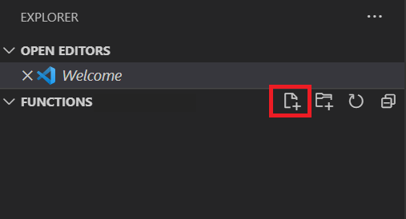

Let's see how we can use `setTimer` with an anonymous function to display a message on a browser page.

> [!NOTE]
> You can find the full code at the bottom of this exercise.

## Create a sample page

You will start by creating a new page in Visual Studio Code.

1. Open a terminal or command window.
1. Run the following commands to create a new directory and change into it:

    ```bash
    # Windows
    md functions && cd functions

    # macOS or Linux
    md functions && cd functions
    ```

1. Run the following command to open the new directory in Visual Studio Code:

    ```bash
    code .
    ```

1. Inside the *EXPLORER* window in Visual Studio Code, hover over *FUNCTIONS*, and select *New File*.

    

1. Name the new file *index.html* and select Enter

## Add the code to display the message

With our page created, we can now add the code to display our message.

1. Add the following HTML to *index.html* to create the core of the HTML file:

    ```html
    <!DOCTYPE html>
    <html>
    <head>
        <title>Message</title>
    </head>
    <body>
        <script>
            // TODO: Add code

        </script>
    </body>
    </html>
    ```

1. Immediately below the line which reads `//TODO: Add code`, add the following JavaScript to create the timer and pass an anonymous function to display the message *Hello anonymous functions* after 2 seconds:

    ```javascript
    // TODO: Add code
    setTimeout(
        () => { document.write('Hello anonymous functions')},
        2000
    );
    ```

1. Save the file by selecting *File* > *Save*.

## View the page

Our page is now created! Let's see how it looks.

1. Open the Visual Studio Code command pallette by by selecting *Ctl-Shift-P* (or *Cmd-Shift-P* on a Mac).
1. Open [Live Server](https://marketplace.visualstudio.com/items?itemName=ritwickdey.LiveServer) by typing *Live Server* in the command pallette and selecting *Live Server: Open with Live Server*.

    

1. Live Server will start and open your browser window. After two seconds you will see the message *Hello anonymous functions* display in your browser window!

You have now created and used an anonymous function in JavaScript by using the arrow (or fat arrow) syntax.

## Full code

```html
<!DOCTYPE html>
<html>
<head>
    <title>Message</title>
</head>
<body>
    
    <script>
        // TODO: Add code
        setTimeout(
            () => { document.write('Hello anonymous functions')},
            2000
        );
    </script>
</body>
</html>
```
