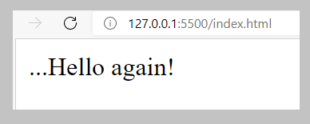

Let's see how we can use `setTimer` with an anonymous function to display a message on a browser page. You will create the code to display a message after a two second delay.

> [!NOTE]
> You can find the full code at the bottom of this exercise.

## Return to Visual Studio

You will use the same file you used in the prior exercise to complete this one.

1. Return to Visual Studio Code.
1. Ensure *index.html* is open in Visual Studio Code.

## Add the code to display the message

You will now add the code to display the message, which will have a two second delay.

1. Below the line which reads `// TODO: Add setTimeout code` add the following code:

    ```javascript
    // TODO: Add setTimeout code
    setTimeout(
        () => { document.write('...Hello again!')},
        2000
    );
    ```

1. Save the file by selecting *File* > *Save*. Live Server will automatically refresh the page for you when you save the file.

## View the page

Let's see the results!

1. Return to your browser window.

    > [!NOTE]
    > You may already see the message displayed "...Hello again!" because Live Server will have already refreshed the window.

1. Refresh the browser window. Notice the original message displays, and is replaced after two seconds by '...Hello again!'

    

You have now used an anonymous function to have a message appear on a delay.

## Full code

```html
<!DOCTYPE html>
<html>
<head>
    <title>Message</title>
</head>
<body>
    <script>
        // TODO: Add hello code
        function getMessage(name) {
            return 'Hello, ' + name + '...';
        }
        const message = getMessage('Ornella');
        document.write(message);

        // TODO: Add setTimeout code
        setTimeout(
            () => { document.write('...Hello again!')},
            2000
        );
    </script>
</body>
</html>
```
